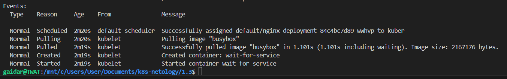

### Задание 1. Создать Deployment и обеспечить доступ к репликам приложения из другого Pod

Во избежание ошибки сразу-же посадил multitool на порт 8080. Тем не менее, пока не добавил sleep infinity во внутрь контейнера, он падал с ошибкой.

Pod без масштабирования

Pod с масштабированием

IP адреса реплик

Созданный service

Service подключен к репликам

Созданный Pod multitool и запрос curl с него

Манифесты [Deployment Nginx+Multitool](deployment_nginx_multitool.yaml), [Service](service_for_replicas.yaml), [Pod multitool for curl](pod_multitool.yaml)

### Задание 2. Создать Deployment и обеспечить старт основного контейнера при выполнении условий

Ожидание сервиса, после которого должен стартовать nginx было реализовано через проверку локального домена (nginx-service.default.svc.cluster.local) в default namespace, чтобы отсечь лишние домены от яндекса

Ожидание сервиса

После старта сервиса

Манифесты [Deployment Nginx with BusyBox](deployment_nginx_busybox.yaml), [Service](service_for_replicas.yaml)