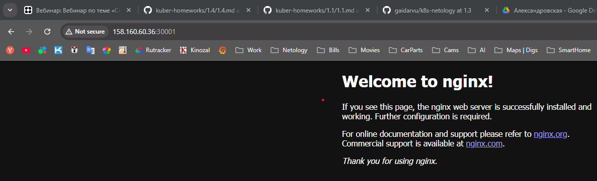

### Задание 1. Создать Deployment и обеспечить доступ к контейнерам приложения по разным портам из другого Pod внутри кластера

Pod multitool и запрос curl с него

На 9001

На 9002

Манифесты [deployment_nginx_multitool.yaml](deployment_nginx_multitool.yaml), [Pod multitool for curl](pod_multitool.yaml)

### Задание 2. Создать Service и обеспечить доступ к приложениям снаружи кластера

Запрос с браузера

Запрос curl с консоли

Манифест [Service](service_for_nginx_external.yaml)