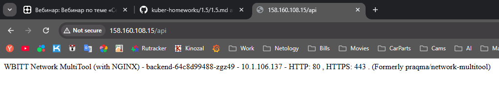

### Задание 1. Создать Deployment приложений backend и frontend

Запущеные поды и демонстрация видимости

### Задание 2. Создать Ingress и обеспечить доступ к приложениям снаружи кластера

Запрос с браузера

front

back

Общий манифест [Deployments+Services+Ingress](deployment_front_backend.yaml)