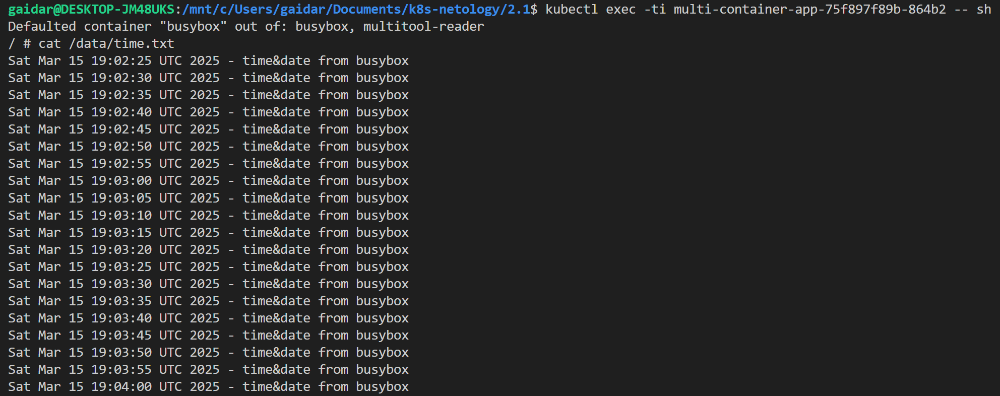
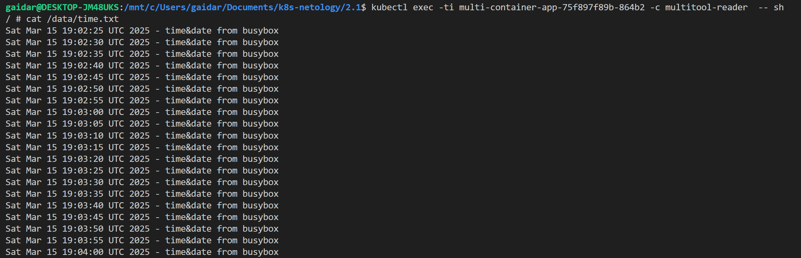
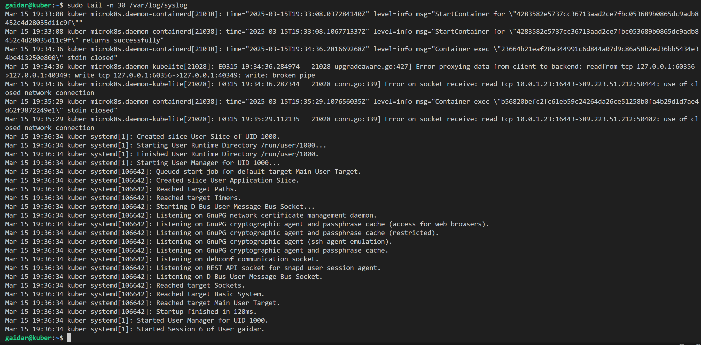
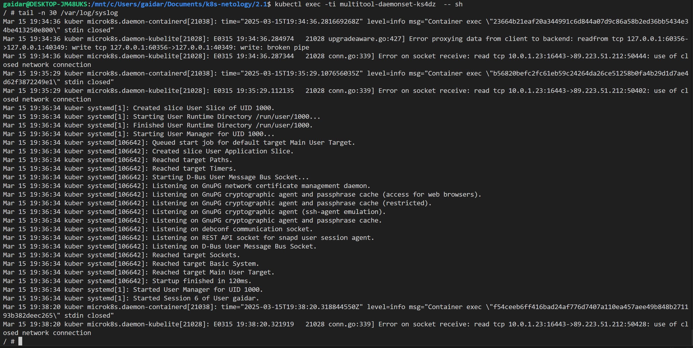

### Задание 1. Создать Deployment приложения, состоящего из двух контейнеров и обменивающихся данными.

Вывод файла с busybox

Вывод файла с multitool

Манифест [Deployment](deployment_multitool_busybox.yaml)

### Задание 2. Создать DaemonSet приложения, которое может прочитать логи ноды.

Чтение файла из ноды яндекс-клауд

Чтение файла изнутри пода 

Манифест [DaemonSet](daemonset_multitool.yaml)