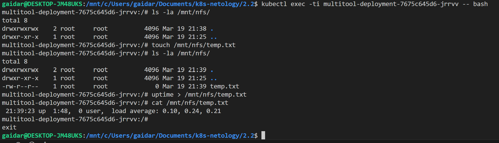

### Задание 1. Создать Deployment приложения, использующего локальный PV, созданный вручную.

Чтение файла с multitool, в который пишет busybox

После удаления Deployment и PVC, PV будет в состоянии Released. У PV есть reclaimPolicy, который определяет, что делать с хранилищем после удаления PVC.

Если reclaimPolicy: Retain, Kubernetes не удаляет данные, а оставляет PV в состоянии Released.

Файл должен быть доступен, потому что PV использует локальную директорию на хосте, и данные сохраняются на этом диске.

После удаления PV файл на локальном диске останется, потому что PV не управляет удалением данных на локальной папке (hostPath).

Манифест [Deployment](deployment_multitool_busybox.yaml)

### Задание 2. Создать Deployment приложения, которое может хранить файлы на NFS с динамическим созданием PV.

Созданные pod, pv, pvc

Пробуем создать файл и записать туда информацию

Удалось отыскать его на ноде в default-storage

Почему-бы не записать файл напрямую в сторадж

Идем на pod и смотрим что получилось

Манифест [Deployment](deployment_multitool.yaml)