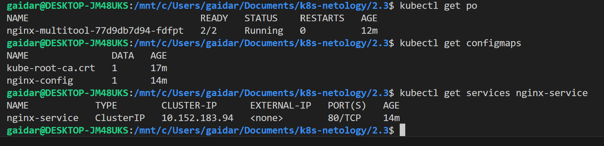
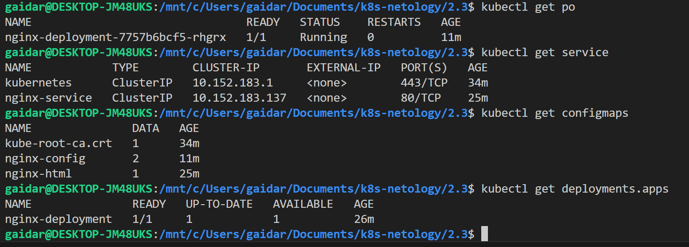
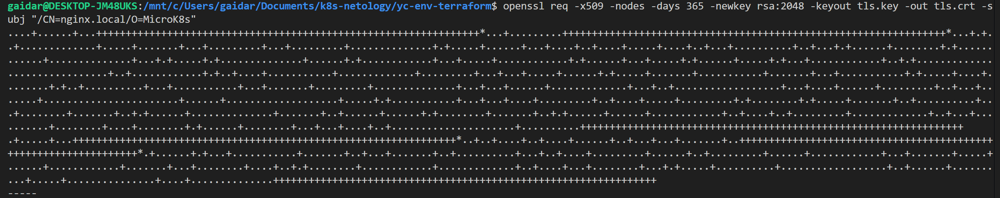
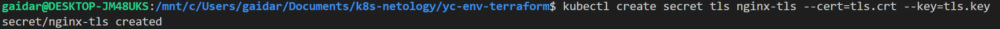
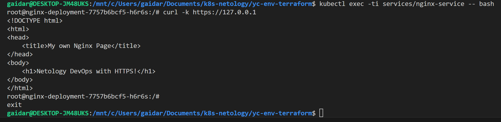

### Задание 1. Создать Deployment приложения и решить возникшую проблему с помощью ConfigMap. Добавить веб-страницу

Поды поднялись

Доступ к страничке через консоль

Доступ к страничке через web с проброшенным портом

index.html в смонтированной директории

Манифесты [Deployment](deployment_multitool_nginx.yaml), [Service](service.yaml), [ConfigMaps](configmap.yaml)

### Задание 2. Создать приложение с вашей веб-страницей, доступной по HTTPS

Поды поднялись

Генерим самоподписанный сертификат

Доступ по https из service

Манифесты [Deployment](deployment_nginx.yaml), [Service](service_nginx.yaml), [ConfigMaps](configmap_nginx.yaml), [Ingress](ingress.yaml)