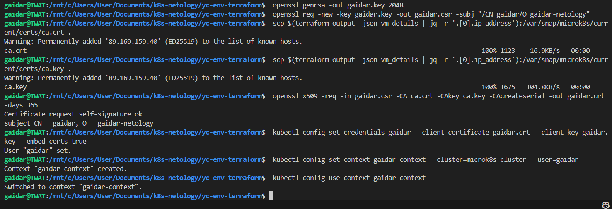
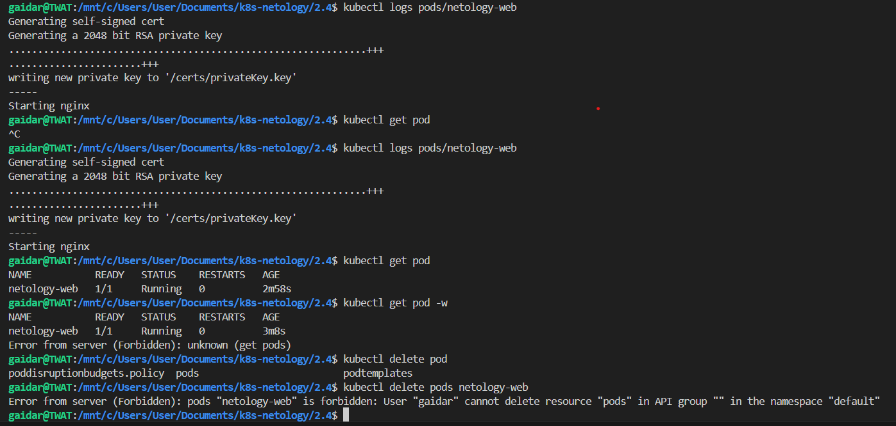

### Задание 1. Создайте конфигурацию для подключения пользователя

Генерим сертификат и создаем пользователя

Поднял роль и роль-биндинг

Для проверки разрешений поднял простой Pod из второго вебинара. Как видно, что нужно - разрешено, что не нужно - запрещено.

Для поднятия роли и пода пришлось в kubectl переключаться между админом и пользователем

Манифесты [Role](role.yaml), [RoleBinding](rolebinding.yaml), [Pod](pod-netology-web.yaml)
