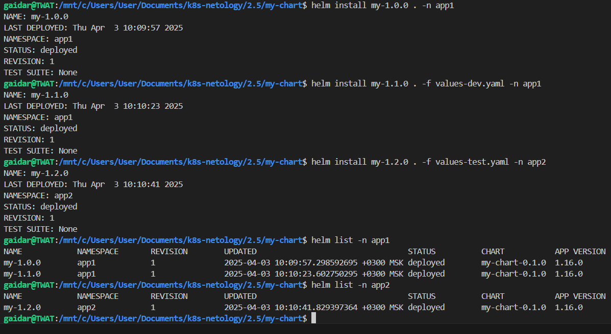
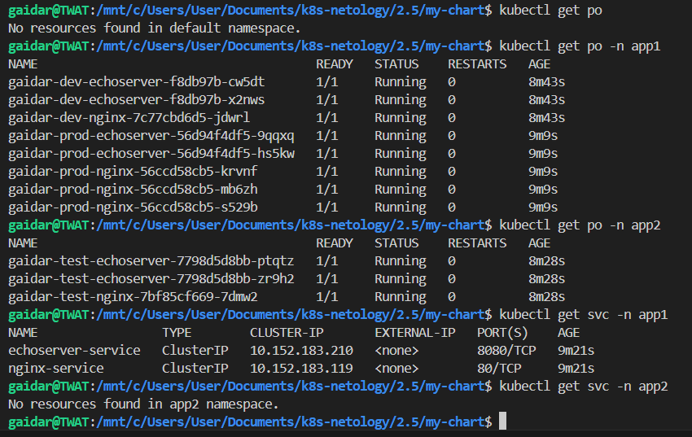

### Задание 1. Подготовить Helm-чарт для приложения

helm-чарт готов и нормально поднимается

### Задание 2. Запустить две версии в разных неймспейсах

Деплой компонентов в расные namespaces

Что получилось

Директория с чартом, откуда всё поднималось [my-chart](my-chart)
